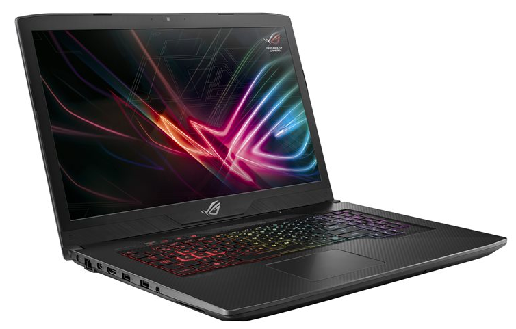
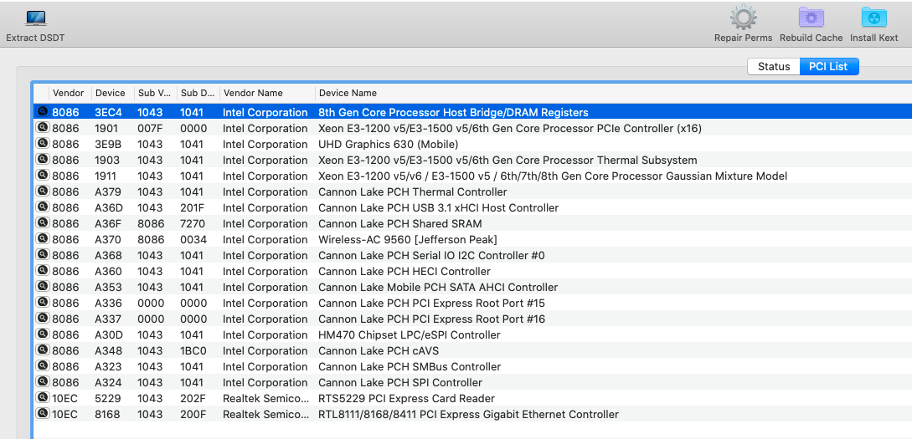
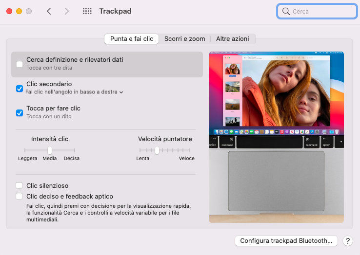

# Asus ROG GL703ge Bios V 321

### Laptop Spec:
| Component        | Brank                              |
| ---------------- | ---------------------------------- |
| CPU              | Intel I7 8750H                     | 
| IGPU             | Intel® UHD Graphics 630            |
| Audio            | Realtek ALC290                     |
| Ram              | 16 Gb DDR4 2400 Mhz                |
| Wifi + Bluetooth | Intel                              |
| NVMe             | Samsung 970 Pro 512Gb              |
| SmBios           | MacbookPro 15.3                    |

## DPCIManager Screenshot

## TouchPad and Gesture

### What works and What doesn't or WIP:

- [x] Intel UHD 630 iGPU HDMI Output
- [x] ALC290 Internal Speakers
- [x] ALC290 Native Combojack headphones
- [x] ALC290 HDMI Audio Output
- [x] All USB Ports 
- [x] SpeedStep / Sleep / Wake
- [x] I2C Touchpad with gesture
- [x] Brightness Key
- [x] Wi-Fi and Bluetooth Intel AX201 160MHz
- [x] Realtek RTL8111 LAN
- [x] USB Cardreader
- [x] ACPI Battery
- [x] NVRAM
- [x] Windows boot from OpenCore

### Special Config:

- Usb port mapping performed
- Cosmetics DSM in Configplist

## Credits

- [Acidanthera](https://github.com/acidanthera) for OpenCore and all the lovely hackintosh work.
- [Apple](https://apple.com) for macOS;
- [daliansky](https://github.com/daliansky)
- [Dortania](https://github.com/dortania)
- [Hackintoshlifeit](https://github.com/Hackintoshlifeit)
- [rehabman](https://github.com/RehabMan)

# If you need help please contact us on [Telegram](https://t.me/HackintoshLife_it) or [Web](https://www.hackintoshlife.it/)
